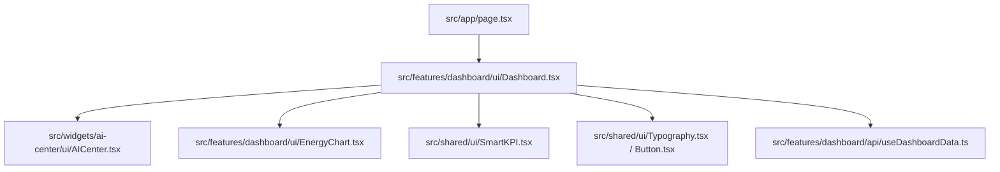

# 📄 [TECH SPEC] — EcoVolt Dashboard Enterprise Refactor

Este documento estabelece o plano técnico e arquitetural de refatoração para a tela principal (Dashboard) do EcoVolt, alinhado à constituição do **@agente-core** e às diretrizes **GEMINI.md**.

---

## 🎯 1. OBJETIVO & TAXONOMIA SOCRÁTICA
Elevar o dashboard de um estado de template MVP para uma **Central de Telemetria e Eficiência Energética Enterprise** com design premium de altíssimo polimento (Estética 2026), resiliência a falhas, performance otimizada de renderização e eliminação total de saltos de layout (*Layout Shift*).

### 🚦 Classificação da Tarefa: **Build / Refatoração Complexa**
Modificações estruturais em múltiplos componentes e camadas (FSD) exigem validação de boundaries, integridade do backend (Convex) e design de performance.

---

## 🏛️ 2. DECISÕES ARQUITETURAIS (FSD & CLEAN CODE)

Para manter o acoplamento baixo e boundaries herméticos, o dashboard será reestruturado seguindo as regras rígidas do **Feature-Sliced Design (FSD)**:

### ⚡ Regra de Fluxo de Imports
*   `src/app` (Roteamento & Configuração) imports de `features` e `widgets`.
*   `src/widgets` (Blocos Autônomos de Tela) imports de `features`, `entities`, e `shared`.
*   `src/features` (Lógica de Negócio com UI) imports de `entities` e `shared`.
*   `src/entities` (Conceitos de Negócio, ex: Telemetria) imports de `shared`.
*   `src/shared` (Agnóstico, Componentes Atômicos) **NUNCA** importa das camadas superiores.

---

## 🎨 3. DIRETRIZES DE DESIGN ENGINEERING (ESTÉTICA 2026)

### A. Materialidade Glassmorphism 2.0 (Deep Dark 3-Tier)
Ajuste da paleta de cores globais no `src/app/globals.css` para a escala AMOLED física de alto contraste:
*   **L0 (Fundo Base):** `#0D0D0D` (Pure Ink Black).
*   **L1 (Painéis/Cards):** `#161616` translúcido (`rgba(22, 22, 22, 0.45)`) com `backdrop-filter: blur(20px)` e bordas de `1px solid rgba(255, 255, 255, 0.08)`.
*   **L2 (Popups/Dropdowns/Tooltips):** `#222222` sólido ou com altíssimo contraste.
*   **Aceleração de Hardware:** Inclusão de `transform: translateZ(0)` nos cards e gráficos para forçar renderização via GPU, mitigando gargalos de renderização do renderizador 2D do navegador.

### B. Polimento e Ergonomia de Exibição
1.  **Tabular Numbers (`font-variant-numeric: tabular-nums`):** Aplicado a todos os valores métricos, telemetria e projeções financeiras para garantir alinhamento vertical e estabilidade na mudança de dígitos em tempo real.
2.  **Glued Terms (Termos Colados):** Encapsulamento de unidades e valores (ex: `kWh`, `R$`, `kg CO2`) usando `whitespace-nowrap` ou `&nbsp;` impedindo quebras órfãs.
3.  **Ergonomia de Alvos (Hit Targets):** Botões e elementos interativos da barra de ações garantindo no mínimo `44px` de altura física.
4.  **Cursor de Streaming SSE:** Detecção de atualizações em tempo real com indicador visual piscando em 500ms nos blocos do AI Center.

---

## 🛠️ 4. PLANO DE IMPLEMENTAÇÃO EM 5 FASES

### Fase 1: Atualização do Design System & CSS (`globals.css`)
Inclusão das variáveis físicas de cor 3-tier, animação do cursor de streaming e do utilitário de GPU e tabular numbers.

### Fase 2: Refatoração do `SmartKPI` (`shared/ui/SmartKPI.tsx`)
*   Implementação de tipagem 100% estrita.
*   Inclusão de `tabular-nums` na renderização dos valores.
*   Tratamento físico das unidades de medida sem quebra de layout.
*   Efeito de brilho neon sob interação (hover premium).

### Fase 3: Layout Bento Grid do Dashboard (`features/dashboard/ui/Dashboard.tsx`)
*   Reestruturação da grid do Dashboard em um layout modular Bento unificado.
*   Criação de um **Espelho de Skeleton de Carregamento Próprio (Zero Layout Shift)** que reflete perfeitamente as dimensões dos cards de KPI, Gráfico e AI Center.
*   Adição de um seletor de range temporal interativo (24h, 7d, 30d, 12m) com foco em ergonomia.

### Fase 4: Otimização do Gráfico de Telemetria (`EnergyChart.tsx`)
*   Suporte a gradientes premium dinâmicos baseados nas cores OKLCH.
*   Tooltip personalizado e adaptado às regras de APCA contrast.
*   Aceleração GPU nas animações de transição de dados.

### Fase 5: AI Center com SSE Cursor e Telemetria Real-time
*   Inclusão de um simulador de telemetria em tempo real.
*   Cursor animado piscante simulando SSE stream.
*   Interatividade expandida para detalhes dos insights.

---

## 🚦 5. EXPLORAÇÃO SOCRÁTICA (PERGUNTAS PREEMPTIVAS)

> [!IMPORTANT]
> Para prosseguirmos com a máxima conformidade e segurança técnica, levanto as seguintes questões de arquitetura e segurança:
>
> 1. **Filtro de Range Temporal e Granularidade no Convex:** Ao refatorar o seletor de período (ex: 24h, 7d, 30d), devemos estender as queries Convex `getGlobalStats` e `getGlobalChartData` para aceitar um argumento `timeRange` estruturado via Zod, ou manteremos mocks simulados na API do Feature para os períodos estendidos nesta fase?
> 2. **Segurança de Métrica e Escopo Multitenant:** A ID do usuário hardcoded no hook `useDashboardData` (`k173z269f80ghf8fayte8q4s9s76527q`) é provisória para desenvolvimento local. Quando integramos o Clerk, a busca deve cair estritamente no middleware ou pretendemos implementar leitura automática da sessão do Clerk usando `ctx.auth.getUserIdentity()` no lado do Convex para mitigação de ID Spoofing?
> 3. **Estratégia de Performance do EnergyChart (Recharts):** Gráficos complexos com animações interativas e gradientes podem apresentar queda de framerate (FPS) em telas móveis e notebooks antigos. Pretendemos desativar a animação padrão do Recharts no Mobile usando uma detecção de breakpoint (media query via hook) ou manteremos a aceleração GPU de hardware ativada por padrão para todos?
